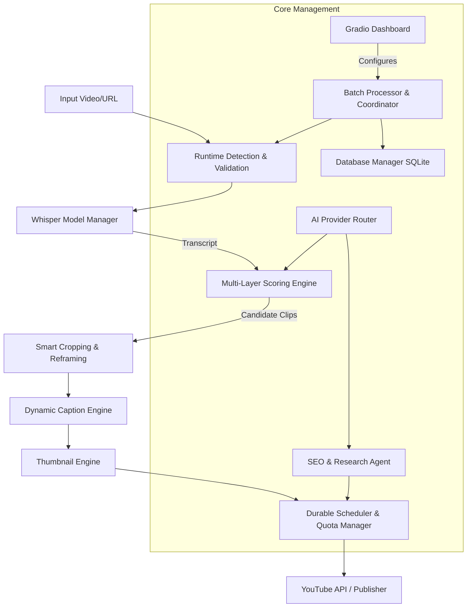

# System Architecture: AI Shorts Factory

This document provides a comprehensive overview of the AI Shorts Factory architecture, detailing its subsystems, data flow, and security mechanisms.

## Pipeline Flow Diagram

## Subsystems

### 1. Runtime Detection
Verifies the execution environment (Local vs. Kaggle vs. Colab), ensuring proper hardware acceleration (CUDA/MPS) is available, and checking for essential binaries like `ffmpeg`.

### 2. Gradio Dashboard
A reactive, web-based UI providing tabs for Source Management, Clip Settings, Quality Control, and Publishing schedules.

### 3. Database Manager (SQLite)
A local, serverless database for tracking video metadata, processing state, generated clips, and scheduled uploads. Ensures the system can recover gracefully from interruptions.

### 4. Whisper Model Manager
Handles the loading, caching, and execution of OpenAI's Whisper models for highly accurate, timestamped transcriptions of input videos.

### 5. Multi-Layer Scoring Engine
The "8-Judge Editorial Engine". It routes the transcript through specialized LLM prompts to evaluate multiple facets of the content:
- **Hook Quality**: Does the first 3 seconds grab attention?
- **Narrative Arc**: Is there a satisfying payoff?
- **Visual Interest**: Are there dynamic scenes?
- **Virality Potential**: Does it fit current trends?

### 6. Smart Cropping
Uses facial detection and object tracking heuristics to reframe 16:9 landscape video into perfectly centered 9:16 vertical shorts, keeping the primary subject in frame.

### 7. Dynamic Caption Engine
Generates styled, animated `.ass` or burned-in subtitles. It aligns text to the millisecond based on Whisper word-level timestamps.

### 8. Thumbnail Engine
Captures the most visually striking frame from the clip and applies stylistic overlays, text, and enhancements to maximize CTR (Click-Through Rate).

### 9. AI Provider Router
Abstracts the LLM API calls, allowing the system to route requests to Google Gemini, OpenAI, or OpenRouter seamlessly depending on configuration and availability.

### 10. SEO & Research Agent
Analyzes the final clip transcript and generates optimized titles, descriptions, and hashtags tailored for YouTube Shorts algorithms.

### 11. Durable Scheduler & Quota Manager
Maintains a queue of scheduled uploads. It respects YouTube API quota limits, automatically pausing and resuming uploads to prevent account suspension.

### 12. Batch Processor & Coordinator
Orchestrates the asynchronous processing of playlists or multiple URLs, managing worker threads and updating the SQLite state.

## Security & Data Persistence

- **Secrets Management**: All API keys and OAuth tokens are strictly read from environment variables or secure credential files (`client_secrets.json`). They are never hardcoded or logged.
- **Data Persistence**: The SQLite database (`clipper.db`) acts as the single source of truth. If the process is killed, the Batch Processor reads from the database on next boot and resumes the exact pipeline step that failed.
- **Artifact Cleanup**: Temporary processing files (raw audio, uncropped video) are securely deleted upon successful clip generation to conserve disk space.
